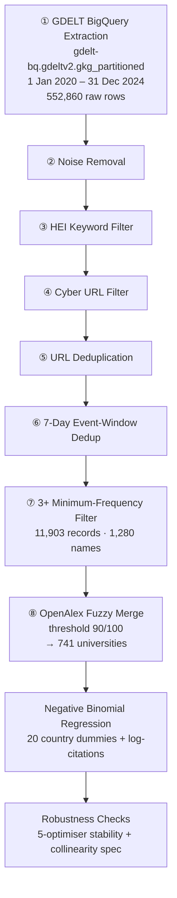

<div align="center">

# 🎓 The Prestige Paradox

### Institutional Bibliometric Status and Cybersecurity Media Salience in Global Higher Education, 2020–2024

*MSc Business Analytics Project · University of Greenwich*


</div>

---

<table align="center">
<tr><td align="center">

**Author**<br>Shreyansh Chaudhary

</td><td align="center">

**Student ID**<br>001487390

</td><td align="center">

**Module**<br>BUSI 1783

</td><td align="center">

**Supervisor**<br>Dr Raunak Mishra

</td><td align="center">

**Submitted**<br>August 2026

</td></tr>
</table>

---

## 📖 Overview

This repository holds the dataset and analytical code behind a dissertation asking whether a **prestige paradox** exists in global cybersecurity news coverage of universities: *do research-heavy institutions, measured by bibliometric citation counts, appear in cybersecurity journalism more often than research-light ones?*

A dataset of **741 universities across 67 countries** was built from **552,860 raw GDELT rows**, merged with OpenAlex bibliometric data, and modelled with a Negative Binomial regression relating institutional prestige to cybersecurity media salience.

> ⚠️ **What the outcome variable actually measures**
> The dependent variable is cybersecurity media *salience* — how often an institution appears in cybersecurity-themed articles — **not confirmed attack victimisation**. GDELT's V2Themes tags are document-level, so a university quoted as an expert source counts the same as one that was breached. This distinction is maintained throughout the analysis.

<div align="center">

### 🎯 Headline Result

| Metric | Value |
|:--|:--:|
| Incidence Rate Ratio (IRR) | **1.207** |
| Interpretation | +20.7% mentions per 1-unit ↑ in log-citations |
| 95% Confidence Interval | 1.185 – 1.230 |
| Significance | p < 0.0001 |
| Controls | Country fixed effects |

</div>

---

## ✨ Key Findings

<table>
<tr>
<td width="50%" valign="top">

### 📈 Prestige Predicts Salience
The citation effect is positive, highly significant, and **stable across four converging optimisers** (BFGS, L-BFGS, Powell, Conjugate Gradient).

</td>
<td width="50%" valign="top">

### 🔀 Not a Perfect Rank-Ordering
Oxford leads on mentions (**155**) despite not holding the top citation count; Harvard tops citations but ranks **9th** on mentions. A Matthew-effect continuum, not a clean elite/non-elite split.

</td>
</tr>
<tr>
<td width="50%" valign="top">

### 🌍 Geographically Concentrated
The US contributes **385 of 741** universities (**51.9%**), partly reflecting GDELT's English-language media bias. No individual country dummy is statistically significant.

</td>
<td width="50%" valign="top">

### 🧭 Honestly Bounded
The 3+ minimum-frequency filter left-truncates the sample — the headline IRR most plausibly **overstates** the true population effect. Adding research volume fails to converge (r = 0.985 collinearity), leaving impact-vs-volume unresolved.

</td>
</tr>
</table>

---

## 🗂️ Repository Contents

| File | Description |
|:--|:--|
| 📓 `analysis_main.ipynb` | Core pipeline — GDELT extraction, cleaning, OpenAlex merge, Negative Binomial regression, main visualisations |
| 📓 `analysis_supplementary.ipynb` | Supplementary figures |
| 🗃️ `gdelt_extraction.sql` | BigQuery extraction query for the GDELT GKG pull |
| 📄 `gdelt_cleaned_dataset.csv` | Cleaned GDELT event dataset (pre-merge) |
| 📄 `prestige_paradox_dataset_741.csv` | Final 741-university analytical dataset used for every reported result |
| 📋 `requirements.txt` | Python package dependencies |
| 📘 `README.md` | This file |

---

## 🧬 Final Dataset Variables

`prestige_paradox_dataset_741.csv`

| Column | Description |
|:--|:--|
| `the_official_name` | Institution name as matched in OpenAlex |
| `gdelt_name` | Original GDELT name(s) merged into this record (`;`-separated) |
| `cyber_news_count` | GDELT cybersecurity media mentions, 2020–2024 **(dependent variable)** |
| `cited_by_count` | Cumulative OpenAlex citation count (raw) |
| `works_count` | Total published works indexed in OpenAlex |
| `log_cited_by_count` | log(cited_by_count + 1) — **primary independent variable** |
| `log_works_count` | log(works_count + 1) |
| `country` | ISO two-letter country code |
| `match_score` | Fuzzy match score against OpenAlex (≥ 90) |
| `prestige_tier` | Elite / High / Medium / Low, by cited_by_count thresholds |

---

## 🔧 Method in Brief



**Modelling.** Negative Binomial regression (overdispersion ratio = **22.81**, ruling out Poisson), with 20 country dummies and log-citation count as the primary predictor.

**OpenAlex merge detail.** An earlier threshold of 80 produced false merges — notably the *He University* collapse of unrelated name-fragments — caught by manual validation and removed before finalising the 741-university dataset.

<details>
<summary><b>🔍 Why 741 and not 742?</b></summary>
<br>

The pre-merge file had 742 rows. Manual validation identified one false merge — seven unrelated GDELT name-fragments had collapsed onto a single OpenAlex record (*He University*), attributing 32 spurious events to it. Removing it gives the analytical **N = 741**.

</details>

<details>
<summary><b>🔍 Reconciling 11,903 vs 10,265 events</b></summary>
<br>

**11,903** is the cleaned event count across all 1,280 pre-merge names. The final dataset holds **10,265** events, keeping only the 741 universities that matched to OpenAlex. The difference belongs to the 300 unmatched names and the removed *He University* merge.

</details>

---

## 🌐 Data Sources

| Source | Details |
|:--|:--|
| **GDELT 2.0 Global Knowledge Graph** | Google BigQuery (`gdelt-bq.gdeltv2.gkg_partitioned`), 2020–2024, accessed June 2025, open research use — [gdeltproject.org](https://www.gdeltproject.org) |
| **OpenAlex** | REST API ([api.openalex.org/institutions](https://api.openalex.org/institutions)) — `cited_by_count`, `works_count`, `country_code`, institution type. CC0 licence, accessed June 2025 — [openalex.org](https://openalex.org) |

---

## 💻 Environment

```bash
pip install pandas numpy statsmodels thefuzz requests matplotlib seaborn scipy google-cloud-bigquery
```

---

## ⚖️ Known Limitations

| # | Limitation |
|:--:|:--|
| 1 | **Left-truncation bias** — the 3+ frequency filter admits only media-visible universities, so the estimated prestige gradient likely overstates the population effect |
| 2 | **300 unmatched universities (23.4%)** excluded at the merge stage; direction of resulting bias cannot be verified from available data |
| 3 | **GDELT English-language bias** — non-Anglophone institutions are under-represented |
| 4 | **Cumulative citations** — `cited_by_count` is all-time as of June 2025, not bounded to 2020–2024 |
| 5 | **Cross-sectional design** — no causal direction can be established |
| 6 | **Pseudo R² = 0.075** — prestige and country explain roughly 7.5% of deviance |

---

## 📚 Citation

```
Chaudhary, S. (2026) The Prestige Paradox: Institutional Bibliometric Status and 
Cybersecurity Media Salience in Global Higher Education, 2020-2024. 
MSc Dissertation, University of Greenwich, BUSI 1783.
```

---

<div align="center">

## 📄 Licence

Shared for academic assessment under University of Greenwich BUSI 1783 module requirements.
Data derived from GDELT (open research use) and OpenAlex (CC0).
All original analytical code is the work of the author.

</div>
